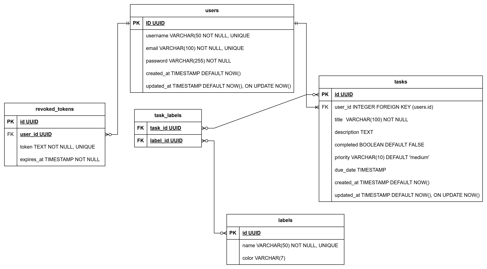

### **Definición de la Base de Datos para el Sistema de Gestión de Tareas**
Basado en tu alcance, propongo un esquema robusto y escalable con autenticación JWT. Incluyo tablas esenciales y campos clave, además de mejoras futuras.

---

## **📌 Esquema Principal**

### **1. Tabla `users` (Autenticación)**
| Campo           | Tipo         | Descripción                          | Restricciones                     |  
|-----------------|--------------|--------------------------------------|-----------------------------------|  
| `id`            | `UUID`     | Identificador único.                 | `PRIMARY KEY`                     |  
| `username`      | `VARCHAR(50)`| Nombre de usuario (único).          | `NOT NULL, UNIQUE`                |  
| `email`         | `VARCHAR(100)`| Correo electrónico.                 | `NOT NULL, UNIQUE`                |  
| `password_hash` | `VARCHAR(255)`| Hash de contraseña (bcrypt).        | `NOT NULL`                        |  
| `created_at`    | `TIMESTAMP`  | Fecha de creación.                   | `DEFAULT NOW()`                   |  
| `updated_at`    | `TIMESTAMP`  | Fecha de actualización.              | `DEFAULT NOW(), ON UPDATE NOW()`  |  

**Mejoras futuras:**
- Añadir `role` (ej: `admin`, `user`) para autorización.
- Campos como `last_login` o `is_active`.

---

### **2. Tabla `tasks` (Tareas)**
| Campo           | Tipo          | Descripción                          | Restricciones                     |  
|-----------------|---------------|--------------------------------------|-----------------------------------|  
| `id`            | `UUID`      | Identificador único.                 | `PRIMARY KEY`                     |  
| `title`         | `VARCHAR(100)`| Título de la tarea.                  | `NOT NULL`                        |  
| `description`   | `TEXT`        | Descripción detallada.               |                                   |  
| `completed`     | `BOOLEAN`     | Estado de completado.                | `DEFAULT FALSE`                   |  
| `priority`      | `VARCHAR(10)` | Prioridad (`low`, `medium`, `high`). | `DEFAULT 'medium'`                |  
| `due_date`      | `TIMESTAMP`   | Fecha límite (opcional).             |                                   |  
| `created_at`    | `TIMESTAMP`   | Fecha de creación.                   | `DEFAULT NOW()`                   |  
| `updated_at`    | `TIMESTAMP`   | Fecha de actualización.              | `DEFAULT NOW(), ON UPDATE NOW()`  |  
| `user_id`       | `UUID`     | Usuario asignado.                    | `FOREIGN KEY (users.id)`          |  

**Mejoras futuras:**
- Añadir `labels` (etiquetas) como `JSONB` o tabla separada.
- Índices para búsqueda rápida (`priority`, `due_date`).

---

### **3. Tabla `revoked_tokens` (JWT Invalidados)**
| Campo         | Tipo         | Descripción                          | Restricciones         |  
|--------------|--------------|--------------------------------------|-----------------------|  
| `id`         | `UUID`     | Identificador único.                 | `PRIMARY KEY`         |  
| `token`      | `TEXT`       | Token JWT revocado.                  | `NOT NULL, UNIQUE`    |  
| `expires_at` | `TIMESTAMP`  | Fecha de expiración del token.       | `NOT NULL`            |  

**Propósito:**
- Almacenar tokens invalidados antes de su expiración (para logout seguro).

---

## **📌 Extensiones Recomendadas**

### **4. Tabla `labels` (Etiquetas/Opcional)**
| Campo       | Tipo          | Descripción                | Restricciones         |  
|------------|---------------|----------------------------|-----------------------|  
| `id`       | `UUID`      | Identificador único.       | `PRIMARY KEY`         |  
| `name`     | `VARCHAR(50)` | Nombre de la etiqueta.     | `NOT NULL, UNIQUE`    |  
| `color`    | `VARCHAR(7)`  | Código HEX (ej: `#FF5733`).|                       |  

### **5. Tabla `task_labels` (Relación Tareas-Etiquetas)**
| Campo       | Tipo      | Descripción                | Restricciones                 |  
|------------|-----------|----------------------------|-------------------------------|  
| `task_id`  | `UUID`    | ID de la tarea.            | `FOREIGN KEY (tasks.id)`      |  
| `label_id` | `UUID` | ID de la etiqueta.         | `FOREIGN KEY (labels.id)`     |  

---

## **🔍 Índices Clave**
Para optimizar consultas frecuentes:
```sql
-- Búsqueda por usuario
CREATE INDEX idx_tasks_user_id ON tasks(user_id);

-- Búsqueda por prioridad
CREATE INDEX idx_tasks_priority ON tasks(priority);

-- Búsqueda por estado (completed)
CREATE INDEX idx_tasks_completed ON tasks(completed);

-- Búsqueda de texto en título/descripción (full-text search)
CREATE INDEX idx_tasks_search ON tasks USING GIN(to_tsvector('english', title || ' ' || description));
```

---

## **🎯 Beneficios de este Esquema**
✅ **Normalizado**: Sin datos redundantes.  
✅ **Escalable**: Fácil añadir relaciones (ej: etiquetas, equipos).  
✅ **Seguro**: JWT manejado correctamente con tokens revocados.  
✅ **Eficiente**: Índices para consultas rápidas.

## Imagen



- [DiagramDataBaseDiagram](./DataBaseDiagram.drawio)